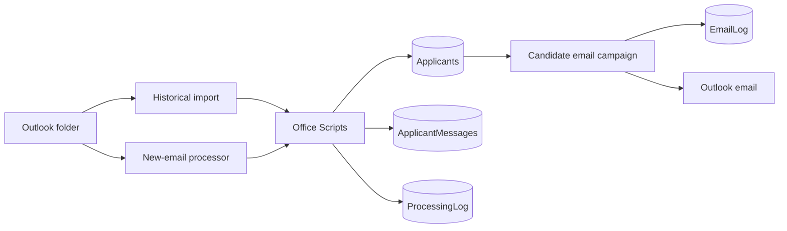

# Applicant Automation for Microsoft 365

An organization-neutral, open-source reference implementation that imports applicant emails from Outlook into Excel, deduplicates candidates, calculates a transparent screening score, logs processing errors, and sends controlled selected/rejected email campaigns.

No tenant, organization, mailbox, applicant, credential, connection, workbook, or signed trigger data is included.

## Included

- Office Scripts for extraction, scoring, idempotent upsert, validation, logging, and email reservation/finalization
- Power Automate design references for historical import, new-email processing, and candidate communications
- Excel schemas for `Applicants`, `ApplicantMessages`, `ProcessingLog`, and `EmailLog`
- Environment-variable and connection-reference specifications
- VS Code tasks, validation scripts, deployment guidance, and sanitized interface illustrations
- Organization-neutral selected and rejected email templates

> The flow JSON files are design references, not portable tenant exports. Microsoft assigns connection, workbook, script, folder, and trigger identifiers inside each tenant. Build the solution-aware flows using the guide, then export your own solution.

## Start here

Follow the [complete implementation guide](docs/IMPLEMENTATION_GUIDE.md), covering prerequisites, VS Code, CLI authentication, workbook creation, Office Scripts, solution components, flow construction, pagination, TEST mode, production rollout, export, and troubleshooting.

## Architecture



## Safety defaults

- Missing values remain blank; extraction does not invent information.
- Normalized email and MessageID provide identity and idempotency.
- Excel/Office Script operations run sequentially.
- Blank scores never trigger candidate email.
- Bulk email requires internal TEST runs and exact `CONFIRM SEND` confirmation.
- Selected and rejected campaigns are separate explicit runs.
- `EmailLog` prevents duplicate campaign messages.
- Continuous processing stays off until historical import is validated.

## Repository layout

| Path | Purpose |
|---|---|
| `office-scripts/` | Scripts copied into Excel for the web |
| `src/power-platform/flows/` | Flow design references |
| `src/power-platform/environment-variables/` | Generic variable specification |
| `src/power-platform/connection-references/` | Connector reference specification |
| `templates/` | Organization-neutral HTML email templates |
| `config/` | Placeholder-only environment configuration |
| `docs/` | Build, security, testing, and troubleshooting guides |
| `scripts/` | Local validation and tenant export helpers |

## Validate

```powershell
pwsh ./scripts/validate.ps1
```

## Security

Never commit an applicant workbook, resume, email, tenant URL, environment/folder/workbook/script/connection ID, authorization header, cookie, token, signed trigger URL, or unsanitized solution export. See [SECURITY.md](SECURITY.md).

## License

MIT. See [LICENSE](LICENSE).
