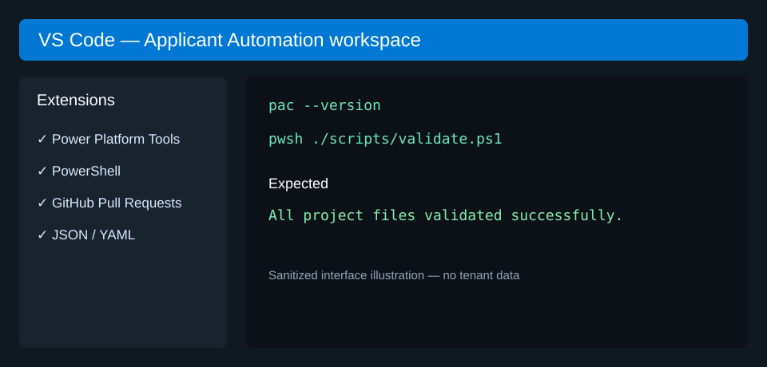
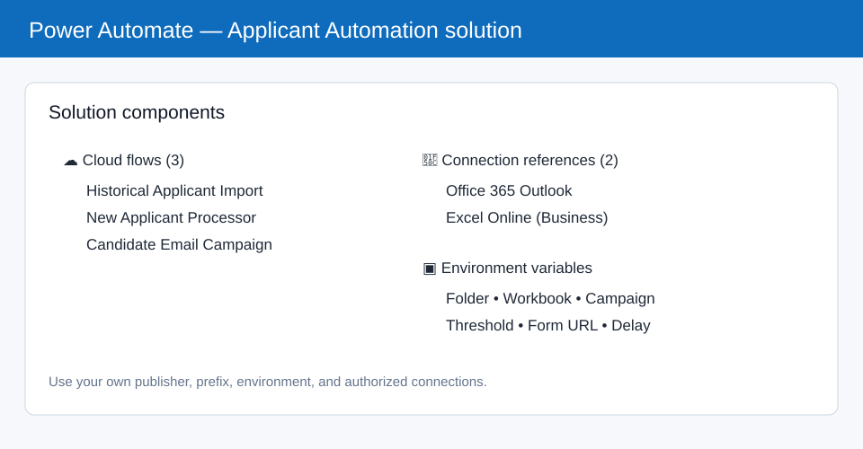
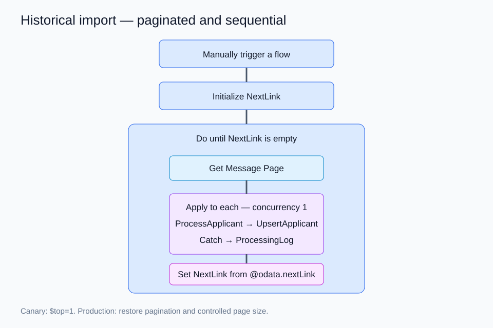
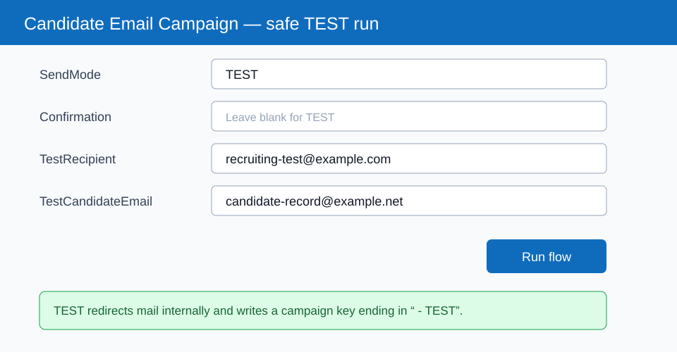

# Complete implementation guide

This guide builds the project in your own Microsoft 365 tenant. Portal labels can change slightly. Included images are sanitized interface illustrations, not tenant screenshots.

## 1. Prerequisites and VS Code

You need Microsoft 365 Outlook, OneDrive for Business or SharePoint, Excel for the web with Office Scripts, Power Automate, a Dataverse-backed Power Platform environment, VS Code, PowerShell 7+, Git, and Power Platform CLI (`pac`).

Recommended VS Code extensions: Power Platform Tools, PowerShell, GitHub Pull Requests and Issues, plus JSON/YAML language support.



```bash
git clone <YOUR-FORK-URL>
cd Applicant-Automation
pwsh ./scripts/validate.ps1
pac --version
```

## 2. Authenticate to the correct environment

```bash
pac auth create --deviceCode --environment <ENVIRONMENT-ID-OR-URL>
pac auth list
pac env who --environment <ENVIRONMENT-ID-OR-URL>
pac solution list --environment <ENVIRONMENT-ID-OR-URL>
```

Verify the user, environment name, ID, and URL before making changes. Never put credentials in JSON.

## 3. Prepare Outlook and Excel

Create a dedicated Outlook folder such as `Recruiting/Applicants`. Record its display name and resolve its immutable Graph folder ID for an environment variable.

Create `Applicant_Automation.xlsx` in OneDrive for Business or SharePoint. Add worksheets and Excel tables named exactly `Applicants`, `ApplicantMessages`, `ProcessingLog`, and `EmailLog`. Use the schemas in [architecture.md](architecture.md). Keep headers in row 1.

## 4. Install Office Scripts

In Excel for the web select **Automate → New Script** and create, from `office-scripts/`:

1. `ProcessApplicant`
2. `UpsertApplicant`
3. `ValidateApplicants`
4. `LogProcessingError`
5. `ReserveCandidateEmail`
6. `FinalizeCandidateEmail`

Run `ValidateApplicants`; continue only when it returns `{"valid":true,"errors":[]}`.

## 5. Create the solution

Select the intended Power Automate environment, then **Solutions → New solution**.

- Display name: `Applicant Automation`
- Name: `ApplicantAutomation`
- Publisher: your own publisher
- Prefix: a short organization-owned prefix, for example `org`
- Version: `1.0.0.0`
- Package type: Unmanaged during development



Add connection references for Office 365 Outlook and Excel Online (Business), authorized with your organization's account.

Create environment variables:

| Variable | Example |
|---|---|
| Outlook Folder Name | `Recruiting/Applicants` |
| Outlook Folder ID | tenant-specific immutable ID |
| Excel File Path | tenant-specific workbook path |
| Excel Table Name | `Applicants` |
| Email Campaign Name | `Graduate Applicant Campaign` |
| Selection Threshold | `80` |
| Screening Form URL | your approved form URL |
| Email Send Delay Seconds | `5` |
| Organization Name | your display/legal name |
| Organization Website | your public website |

## 6. Historical import flow

Create an instant solution-aware flow named `Applicant Automation - Historical Applicant Import`.

1. Add **Manually trigger a flow**.
2. Resolve the Outlook folder using its configured immutable ID.
3. Initialize string variable `NextLink` with the first Graph messages URL.
4. Add **Do until** `NextLink` is empty.
5. Inside it, call Office 365 Outlook **Send an HTTP request**, method `GET`, URI `NextLink`.
6. Apply to `body('Get_Message_Page')?['value']` with concurrency `1`.
7. In a Try scope run `ProcessApplicant`, then `UpsertApplicant`.
8. In a failure scope run `LogProcessingError`; one bad message must not stop the import.
9. Add a delay for Excel throttling.
10. Set `NextLink` from `@odata.nextLink`, or empty when absent.



Use Graph pagination; never impose a fixed total-message limit. Start with `$top=1` and force the next link empty for a canary. After validation, restore pagination and a controlled page size such as 50.

## 7. New-email flow

Create `Applicant Automation - New Applicant Processor` using **When a new email arrives (V3)** bound to the configured folder. Reuse the Try/Catch script pattern. Keep it off until historical import is reconciled.

## 8. Candidate email campaign

Follow [candidate-email-campaign.md](candidate-email-campaign.md). The manual trigger accepts `SendMode`, `Confirmation`, `TestRecipient`, and `TestCandidateEmail`.

List `Applicants` and `EmailLog` with pagination. Filter only nonblank email and score. Use `coalesce()` before `toLower()`, `toUpper()`, or `float()` because Power Automate predicates do not reliably short-circuit; trim both emails before comparison.

Process sequentially. Reserve `EmailLog` before sending, create an Outlook draft, capture its provider ID, send it, and finalize as `SENT`; finalize exceptions as `FAILED`. The duplicate key is `Campaign + CandidateID + EmailType`.



## 9. Validation and rollout

1. Flow Checker reports no blocking errors.
2. Run a one-message historical canary.
3. Confirm `Applicants`, `ApplicantMessages`, and `ProcessingLog` output.
4. Run the complete paginated historical import and reconcile counts.
5. Run one selected TEST to an internal mailbox.
6. Run one rejected TEST internally and confirm it has no form link.
7. Review `EmailLog` TEST rows.
8. Obtain approval for external communication.
9. Run `SELECTED` with exact `CONFIRM SEND`; audit it before `REJECTED`.
10. Confirm there are no `FAILED` or stale `SENDING` rows.

## 10. Export and private production backup

```bash
pac solution export --name ApplicantAutomation --path ./tenant-export/ApplicantAutomation.zip --managed false --environment <ENVIRONMENT-ID>
pac solution unpack --zipfile ./tenant-export/ApplicantAutomation.zip --folder ./tenant-export/unpacked
pac solution check --path ./tenant-export/ApplicantAutomation.zip --environment <ENVIRONMENT-ID>
```

Keep `tenant-export/` Git-ignored and production exports private. Never publish tenant IDs, workbook/script/connection IDs, applicant data, headers, tokens, or signed trigger URLs.

## 11. Operations

- Review `ProcessingLog` and `EmailLog` after every run.
- Retry only `FAILED` rows; investigate stale `SENDING` rows.
- Preserve `SENT` rows for duplicate protection.
- Export a private backup before structural changes.
- Increment solution versions and document deployments.

See [troubleshooting.md](troubleshooting.md) for failure-specific guidance.
